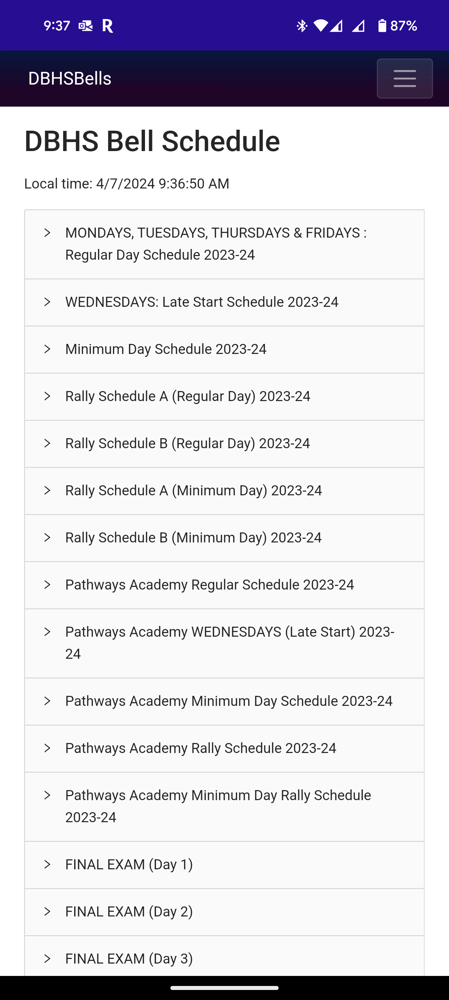
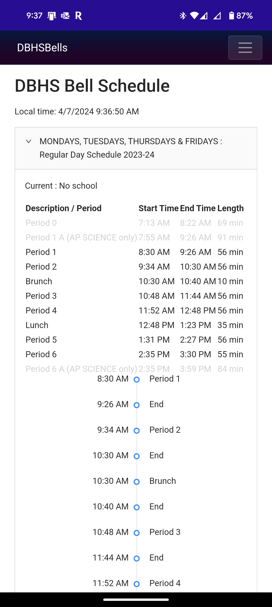
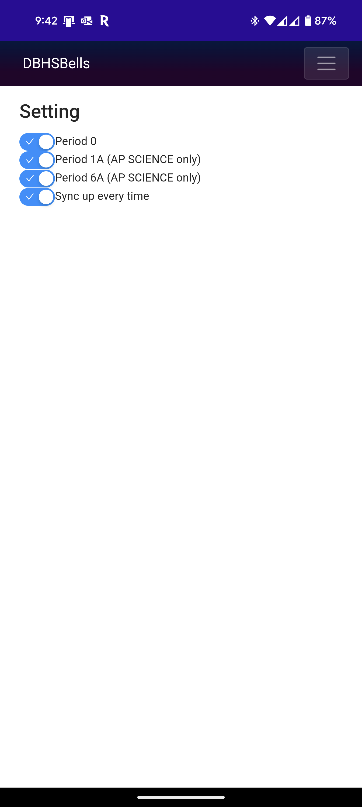

# DBHSBells

DBHSBells is an Windows/Android MAUI application designed to track the bell schedule for Diamond Bar High School. The application is built using C#.

## Screenshots

- Home Page 1. 
  - All DBHS Bell Schedules are shown. You can select one of them to track.
  
- Home Page 2.
  - After selecting a bell schedule, you cae see all the periods in the schedule. 
  - And the timeline is shown below. The current period is highlighted in red. The next period is highlighted in blue. The previous period is highlighted in green.
  

- Setting Page. 
  - You can enable or disable specific periods in the schedule according to your needs.
  - You can also enable or disable the automatic synchronization with the current time.
  

## Features

- **Period Tracking**: The application allows users to track the current period in the school schedule.
- **Customizable Periods**: Users can enable or disable specific periods in the schedule according to their needs.
- **Automatic Synchronization**: The application can automatically sync up with the current time to provide accurate period tracking.

## Usage

After launching the application, navigate to the "Setting" page. Here, you can enable or disable specific periods by toggling the switches next to each period. The application will then track the current period based on your customized schedule.

## Code Overview

- BellScheduleService.cs: This class contains the logic for tracking the current period in the schedule.

There are 2 main methods in the BellScheduleService class:

1. **BellScheduleService**: This is the constructor for the class. It initializes the HttpClient and HtmlParser objects. The httpClient will pretend to be a web browser by setting the User-Agent header to a common browser user agent string.

```csharp
public BellScheduleService(HttpClient httpClient)
{
        _httpClient = httpClient;
        _httpClient.DefaultRequestHeaders.UserAgent.ParseAdd(
            "Mozilla/5.0 (Windows NT 10.0; Win64; x64) AppleWebKit/537.36 (KHTML, like Gecko) Chrome/58.0.3029.110 Safari/537");
        _parser = new HtmlParser();
}
```

2. **GetBellScheduleAsync**: This method retrieves the bell schedule from the school website and returns it as a string. By default, it uses the cached schedules if they are available, but you can force it to fetch the schedules from the website by setting the forceRefresh parameter to true.

```csharp
    /// <summary>
    /// Retrieves the bell schedules from the school website.
    /// </summary>
    /// <param name="forceRefresh">If true, ignores any cached schedules and fetches the schedules from the website. If false and there are cached schedules, uses the cached schedules.</param>
    public async Task<List<Schedule>> GetBellSchedulesAsync(bool forceRefresh = false)
```

- HomePage.xaml.cs: This class contains the logic for updating the current period in the schedule.

- SettingPage.xaml.cs: This class contains the logic for enabling or disabling specific periods in the schedule. To setup the "p0", "p1", "p6", "Sync" switches and save the settings into the Preferences.

```csharp
    private Dictionary<string, bool> switches = new Dictionary<string, bool>();
    private List<string> keys = new List<string> { "p0", "p1", "p6", "Sync" };
    .....
    private void ToggleSwitch(bool e, string switchName)
    {
        switches[switchName] = e;
        Preferences.Set(switchName, e);
    }
```

## NuGet Packages

- **HtmlAgilityPack**: This package is used to parse the HTML content of the school website to extract the bell schedule.
- **AntDesign**: This package is used to create the user interface of the application.

## Contributing

Contributions are welcome. Please fork the repository and create a pull request with your changes.

## License

MIT
